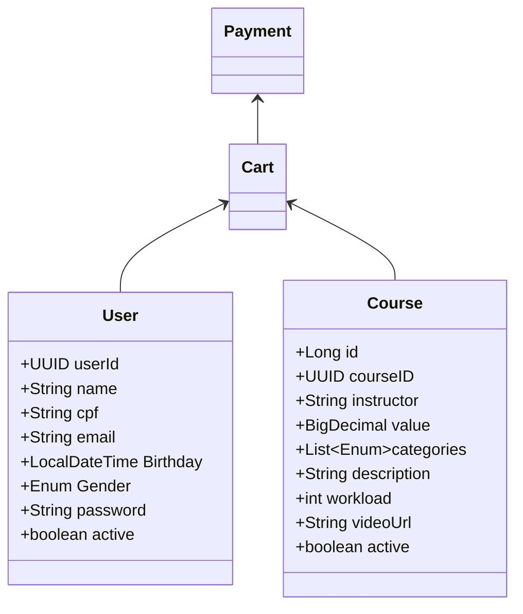

# :computer: Projeto TrueLearn 
Projeto consiste em microsserviços para um e-commerce que vende cursos online. O objetivo a longo prazo é em torná-lo um portal de aprendizagem online.  
**Status: Em Progresso !!**

## :paperclips: Sobre
Este Microsserviço é apenas para funções voltadas para o usuário.

## :wrench: Funcionalidades 
- Cadastro, leitura, atualização e exclusão de usuário.

##   :clipboard: Tecnologias Utilizadas 
- Java 17: Utilizaremos a versão LTS mais recente do Java para tirar vantagem das últimas inovações que essa linguagem robusta e amplamente utilizada oferece;  
- Spring Boot 3: Trabalharemos com a mais nova versão do Spring Boot, que maximiza a produtividade do desenvolvedor por meio de sua poderosa premissa de autoconfiguração;  
- Spring Data JPA: Exploraremos como essa ferramenta pode simplificar nossa camada de acesso aos dados, facilitando a integração com bancos de dados SQL;  
- _Spring Web_ MVC: O Spring MVC é um framework que nos auxilia no desenvolvimento de aplicações web;
- OpenAPI (Swagger): Vamos criar uma documentação de API eficaz e fácil de entender usando a OpenAPI (Swagger), perfeitamente alinhada com a alta produtividade que o Spring Boot oferece;  
- Lombok: É um framework para Java que permite escrever código eliminando a verbosidade, o que permite ganhar tempo de desenvolvimento;
- Web Client: Possui uma API funcional e fluente baseada em Reactor que permite a composição declarativa de lógica assíncrona sem a necessidade de lidar com threads ou simultaneidade.
- RabbitMQ: Message broker altamente consolidado e utilizado por quem trabalha com comunicação entre sistemas. Operando de forma assíncrona, ele age como um intermediário que processa as nossas mensagens entre produtores e consumidores, além de contar com filas que possuem diversas opções de encaminhamento.
- JUnit: É um framework open-source, que se assemelha ao raio de testes software java com suporte à criação de testes automatizados na linguagem de programação Java. Esse framework facilita a criação e manutenção do código para a automação de testes com apresentação dos resultados.
- Mockito:É um framework de teste de código aberto para Java. A estrutura permite a criação de objetos duplos de teste em testes de unidade automatizados para fins de desenvolvimento orientado a testes ou desenvolvimento orientado a comportamento.


##   :bar_chart: Diagrama de classes

## ⚙️ Como Executar
1. Clone o repositório em uma pasta de preferência
  ```
  git@github.com:karenCLima/TrueLearnUser.git
  ```
2. Entre na pasta que você acabou de clonar e instale as dependências
  ```
  mvn install
  ```
3. Visualize a interface da API utilizando o Thunder Client, Postman, Insomnia ou outra plataforma de sua preferência <br>
> **Acesso ao Swagger UI (Opcional)** <br>
   Se preferir, você pode explorar e testar os endpoints da API acessando o Swagger UI. <br>
   Certifique-se de que o projeto esteja em execução e acesse a URL abaixo pelo seu navegador: <br>
   http://localhost:8081/swagger-ui/index.html#/

## 📚 Documentação (endpoints)


> Written with [StackEdit](https://stackedit.io/).
